```mermaid
graph TD
    APP["Next.js App Router :3000"] --> PUBLIC["(publico) login · forgot · reset"]
    APP --> DASH["(dashboard)"]
    DASH --> RESTAURANTS["restaurants/"]
    DASH --> CUSTOMERS["customers/"]
    DASH --> RESERVATIONS["reservations/"]
    DASH --> EVENTS["events/"]
    DASH --> LOYALTY["loyalty/"]
    DASH --> REWARDS["rewards/"]
    DASH --> NOTIFICATIONS["notifications/"]
    DASH --> ANALYTICS["analytics/"]
    DASH --> CONVERSION["conversion/"]
    DASH --> REDIRECTS["redirects/"]
    DASH --> REVIEWS["reviews/"]
    DASH --> USERS["users/"]
    DASH --> PERMISSIONS["permissions/"]
    DASH --> TERMS["terms/"]
    APP --> API["bestfork-backend :3333"]

    style APP fill:#1a1a2e,stroke:#bd00ff,color:#fff
    style API fill:#1a1a2e,stroke:#bd00ff,color:#fff
    style PUBLIC fill:#533483,stroke:#bd00ff,color:#fff
    style DASH fill:#533483,stroke:#bd00ff,color:#fff
    style RESTAURANTS fill:#16213e,stroke:#bd00ff,color:#fff
    style CUSTOMERS fill:#16213e,stroke:#bd00ff,color:#fff
    style RESERVATIONS fill:#16213e,stroke:#bd00ff,color:#fff
    style EVENTS fill:#16213e,stroke:#bd00ff,color:#fff
    style LOYALTY fill:#16213e,stroke:#bd00ff,color:#fff
    style REWARDS fill:#16213e,stroke:#bd00ff,color:#fff
    style NOTIFICATIONS fill:#16213e,stroke:#bd00ff,color:#fff
    style ANALYTICS fill:#16213e,stroke:#bd00ff,color:#fff
    style CONVERSION fill:#16213e,stroke:#bd00ff,color:#fff
    style REDIRECTS fill:#16213e,stroke:#bd00ff,color:#fff
    style REVIEWS fill:#16213e,stroke:#bd00ff,color:#fff
    style USERS fill:#16213e,stroke:#bd00ff,color:#fff
    style PERMISSIONS fill:#16213e,stroke:#bd00ff,color:#fff
    style TERMS fill:#16213e,stroke:#bd00ff,color:#fff
```

<p align="center">
  
</p>

<p align="center">
  
  
  
  
  
  
  
</p>

---

```ini
; zespek@server:~$ cat /etc/motd

[ BestFork Web Master ]
; Painel administrativo do ecossistema BestFork Prime
; 15 modulos de dashboard | App Router | consome a bestfork-backend
; controle de restaurantes, fidelidade, usuarios e permissoes
```

---

<p align="center">
  
</p>

```ini
; zespek@server:~$ cat stack.conf

[runtime]
language         = "TypeScript 5"
runtime          = "Node.js >= 20"
framework        = "Next.js 16 (App Router)"
ui               = "React 19 + react-icons"

[data]
http             = "Axios (src/lib/api.ts — interceptor unico de erro)"
cache            = "TanStack Query 5"
state            = "Zustand 5"

[forms]
forms            = "React Hook Form 7"
validation       = "Zod 3 (@hookform/resolvers)"

[auth]
strategy         = "JWT emitido pela API, persistido em cookie (nookies)"
guard            = "Layout (dashboard) protegido por sessao"

[extras]
dates            = "date-fns 4"
shared           = "packages/shared — tipos e constantes do ecossistema"
port             = "3000"
```

---

<p align="center">
  
</p>



```ini
; zespek@server:~$ tree -L 1 src/

src/app/         = "rotas do App Router — (dashboard) protegido + telas publicas"
src/components/  = "layout (sidebar, header) e ui (tabelas, modais, inputs)"
src/services/    = "uma funcao por endpoint da API, tipada pelo shared"
src/hooks/       = "hooks de dados sobre TanStack Query"
src/stores/      = "Zustand — sessao e estado de UI"
src/lib/         = "axios configurado, formatadores e helpers"
src/providers/   = "QueryClientProvider e providers de sessao"
src/types/       = "tipos locais do painel"
```

---

<p align="center">
  
</p>

```ini
; zespek@server:~$ cat modules.conf

[/restaurants]
desc             = "Cadastro da rede, ambientes e dados de cada restaurante"

[/customers]
desc             = "Base de clientes Prime, tier de fidelidade e historico"

[/reservations · /events]
desc             = "Reservas e agenda de eventos de toda a rede"

[/loyalty · /rewards]
desc             = "Regras de pontuacao, campanhas e catalogo de premios"

[/conversion]
desc             = "Conversao de nota fiscal em pontos"

[/notifications]
desc             = "Campanhas de push e inbox enviado ao app"

[/analytics]
desc             = "Metricas de uso, conversao e engajamento"

[/redirects]
desc             = "Links de redirecionamento rastreados"

[/reviews]
desc             = "Moderacao das avaliacoes feitas no app"

[/users · /permissions]
desc             = "Usuarios internos, perfis de acesso e modulos liberados"

[/terms]
desc             = "Termos de uso e politicas aceitas no app"
```

---

<p align="center">
  
</p>

```ini
; zespek@server:~$ cat security.log

[auth]
protection       = "Token JWT em cookie (nookies), injetado pelo interceptor do Axios"

[guard]
protection       = "Layout (dashboard) redireciona para /login sem sessao valida"

[permissions]
protection       = "Menu e rotas respeitam os modulos do perfil vindo da API"

[secrets]
protection       = "Somente NEXT_PUBLIC_API_URL no client — nenhum segredo no bundle"

[input]
protection       = "Todo formulario validado com Zod antes de chamar a API"
```

---

<p align="center">
  
</p>

```ini
; zespek@server:~$ cat Makefile

[setup]
install          = "npm install       (npm workspaces — nunca yarn/pnpm)"
env              = "cp .env.example .env.local"

[env_vars]
NEXT_PUBLIC_API_URL = "http://localhost:3333 (bestfork-backend)"

[scripts]
dev              = "npm run dev       → Next dev na porta 3000"
build            = "npm run build     → build de producao"
start            = "npm start         → serve o build na porta 3000"
lint             = "npm run lint      → ESLint (eslint-config-next)"
```

```bash
# Quick start
git clone https://github.com/Zespek/bestfork-web-master.git
cd bestfork-web-master
npm install
cp .env.example .env.local

# A API precisa estar rodando em http://localhost:3333
npm run dev
```

---

<p align="center">
  
</p>

```ini
; zespek@server:~$ cat repos.conf

[bestfork-web-master]
url              = "github.com/Zespek/bestfork-web-master"
desc             = "este painel administrativo (Next.js) — porta 3000"

[bestfork-backend]
url              = "github.com/Mestres-da-Web/bestfork-backend"
desc             = "API REST (Express + Prisma) — porta 3333"

[bestfork-web-restaurante]
url              = "github.com/Mestres-da-Web/bestfork-web-restaurante"
desc             = "painel do restaurante (Next.js) — porta 3001"

[bestfork-app-cliente]
url              = "github.com/Mestres-da-Web/bestfork-app-cliente"
desc             = "app do cliente (Expo / React Native)"
```

> `packages/shared` (tipos e constantes do dominio) e replicado nos quatro
> repositorios. Ao alterar um contrato aqui, replique nos demais.

---

<p align="center">
  <strong>Desenvolvido com ❤️ pela equipe <a href="https://www.mestresdaweb.com.br/">Mestres da Web</a></strong><br/>
  <sub>README by <a href="https://github.com/Zespek"><strong>Zespek</strong></a></sub>
</p>
